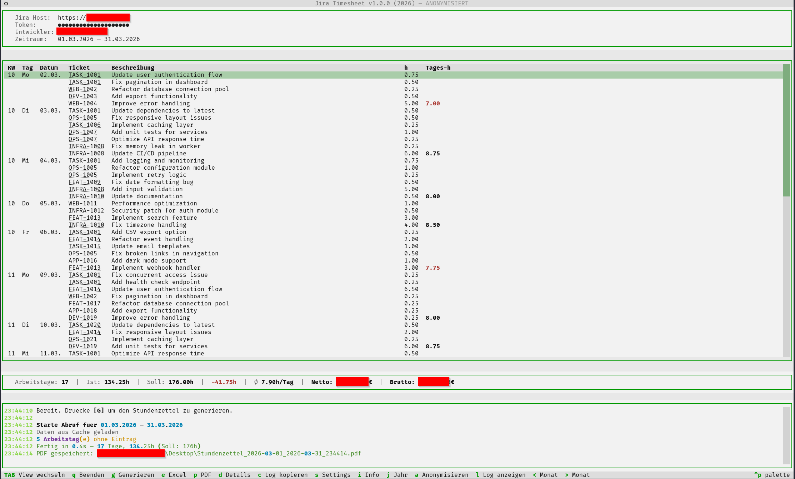
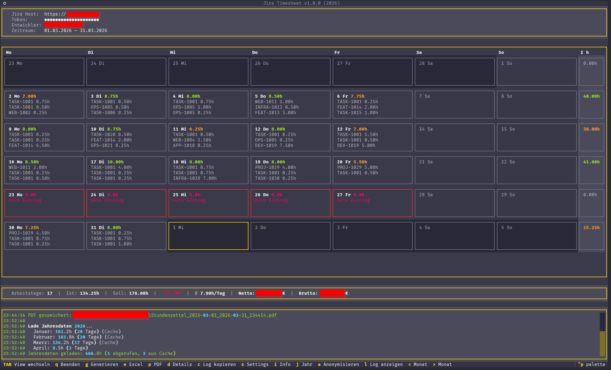
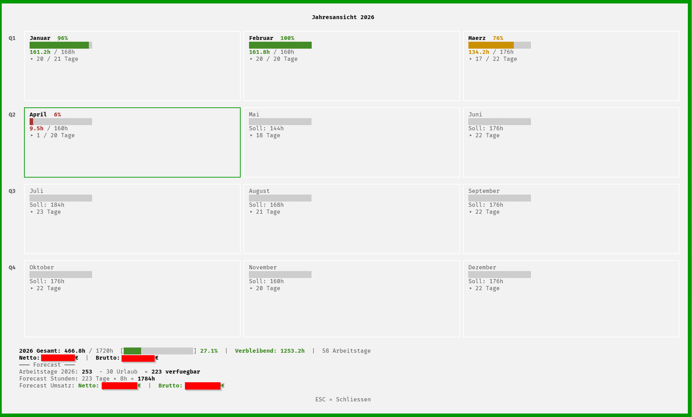
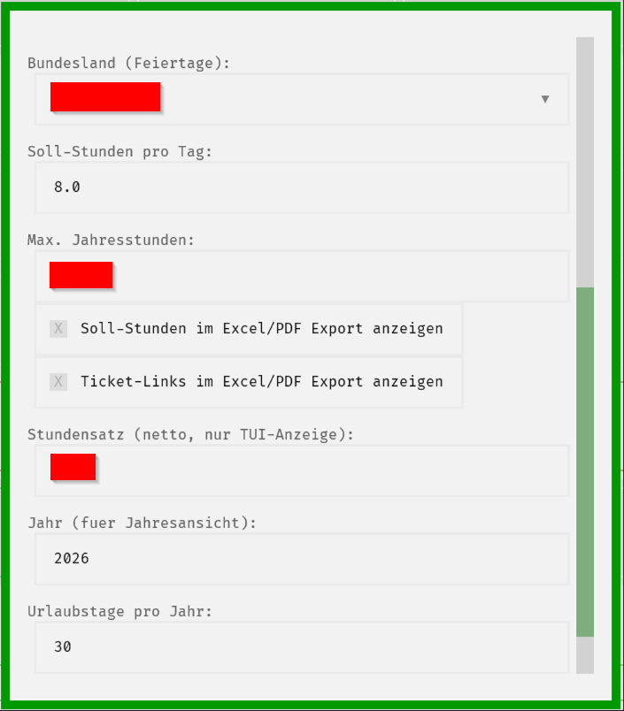

# Jira Timesheet

Terminal-basierte Anwendung (TUI) zum Generieren von Stundenzetteln aus Jira Worklogs.

> **Disclaimer:** Dieses Projekt ist **nicht** von Atlassian entwickelt, unterstuetzt oder autorisiert. "Jira" und "Atlassian" sind eingetragene Markenzeichen von [Atlassian Corporation](https://www.atlassian.com/). Dieses Tool nutzt die oeffentliche Jira REST API und steht in keiner Verbindung zu Atlassian.

## Screenshots

| Listenansicht (Atari ST) | Kalenderansicht (BeOS) |
|---|---|
|  |  |

| Jahresansicht mit Forecast | Settings |
|---|---|
|  |  |

## Features

- **Jira Integration** — Worklogs per REST API abrufen (Bearer Token Auth)
- **Listenansicht** — Tabellarisch mit KW, Wochentag, Tagesgruppen, Soll/Ist-Stunden
- **Kalenderansicht** — Monatskalender mit farbcodierten Tageskacheln (TAB)
- **Jahresansicht** — 12 Monatskacheln mit Progressbar und Forecast (J)
- **Excel-Export** — Formatierter Stundenzettel mit Logo und Unterschriftszeile
- **PDF-Export** — Adobe-signierbar, Unicode-Schriftart (Arial)
- **Feiertage** — Deutsche Feiertage pro Bundesland, Luecken-Erkennung
- **Soll/Ist** — Arbeitszeitvergleich mit Differenz-Anzeige
- **Ticket-Details** — Enter/D zeigt Status, Typ, Bearbeiter, Komponenten im Log
- **Anonymisierung** — Daten per Tastendruck anonymisieren fuer sichere Screenshots
- **Worklog-Cache** — Abgeschlossene Monate gecached, Jahresansicht laedt sofort
- **Retro-Themes** — C64, Amiga, Atari ST, IBM Terminal und mehr (Ctrl+P)

## Installation

```bash
git clone https://github.com/michaelblaess/jira-timesheet.git
cd jira-timesheet
setup.bat
```

## Benutzung

```bash
run.bat
```

Beim ersten Start `S` fuer Settings druecken und konfigurieren:
- Jira Host URL
- Bearer Token
- E-Mail (Jira Username)
- Bundesland (Feiertage)

Dann `G` zum Generieren des Stundenzettels.

## Tastenkuerzel

| Taste | Aktion |
|-------|--------|
| G | Stundenzettel generieren |
| E | Excel-Export |
| P | PDF-Export |
| D | Ticket-Details anzeigen |
| TAB | Listen-/Kalenderansicht wechseln |
| J | Jahresansicht mit Forecast |
| A | Daten anonymisieren |
| < / > | Monat wechseln |
| S | Settings |
| I | Info |
| C | Log kopieren |
| L | Log ein/ausblenden |
| Ctrl+P | Theme wechseln |
| Q | Beenden |

## Konfiguration

Settings werden in `~/.jira-timesheet/settings.json` gespeichert:

| Einstellung | Beschreibung | Default |
|-------------|-------------|---------|
| Jira Host | URL der Jira-Instanz | — |
| Token | Bearer Token fuer Authentifizierung | — |
| E-Mail | Jira Username | — |
| Bundesland | Fuer Feiertagsberechnung | SN |
| Soll-Stunden/Tag | Arbeitsstunden pro Tag | 8.0 |
| Max. Jahresstunden | Obergrenze fuer Progressbar | 1720 |
| Urlaubstage | Fuer Jahres-Forecast | 30 |
| Stundensatz | Netto, nur TUI-Anzeige | 0 (aus) |
| Jahr | Fuer Jahresansicht | aktuelles Jahr |
| Soll-Stunden im Export | Zeigt Soll-Zeile in Excel/PDF | false |
| Ticket-Links im Export | Hyperlinks in Excel/PDF | false |

## Tech Stack

- [Python](https://python.org) >= 3.10
- [Textual](https://textual.textualize.io) — TUI Framework
- [Rich](https://rich.readthedocs.io) — Terminal Formatting
- [httpx](https://www.python-httpx.org) — Async HTTP Client
- [openpyxl](https://openpyxl.readthedocs.io) — Excel Export
- [fpdf2](https://py-pdf.github.io/fpdf2) — PDF Export
- [holidays](https://python-holidays.readthedocs.io) — Feiertagsberechnung

## Lizenz

Apache License 2.0

---

> **Trademark Notice:** "Jira" is a registered trademark of [Atlassian Corporation](https://www.atlassian.com/). This project is not affiliated with, endorsed by, or sponsored by Atlassian.
